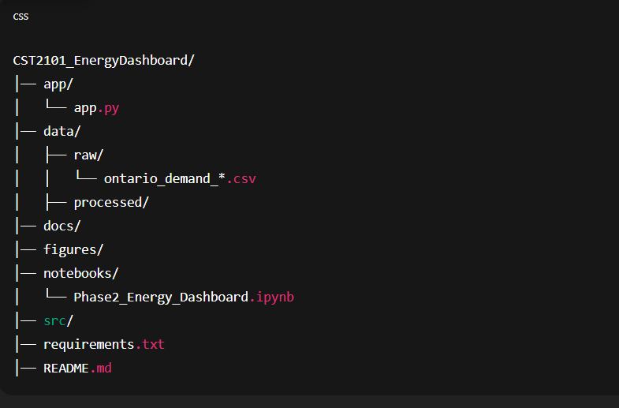

# Ontario Electricity Demand Early-Warning Dashboard

## Overview
This project analyzes Ontario’s 5-minute electricity demand data from the Independent Electricity System Operator (IESO). The goal is to prepare and explore the dataset, build a baseline forecasting model, and later develop an interactive early-warning dashboard.

This repository includes all files required for Phase 2 of the project, along with plans for the final phase.

---

## Phase 2 – Work Completed

### 1. Data Preparation
- Loaded the IESO “Normal Dispatch Totals” CSV file.
- Skipped non-data text rows at the top of the file.
- Selected the `TOTAL LOAD` column as the main demand variable.
- Combined `HOUR` and `INTERVAL` to create a full timestamp.
- Cleaned the dataset (sorted values, removed duplicates, checked missing values).

### 2. Exploratory Data Analysis (EDA)
- Plotted 5-minute demand over time.
- Calculated and visualized average demand by hour of day.
- Added simple time-based features such as `hour_of_day` and `minute_of_hour`.

### 3. Baseline Forecasting
- Used the 5-minute demand series for modeling.
- Created a small train/test split.
- Implemented a simple ARIMA or fallback naive forecast (depending on data size).
- Calculated MAE and MAPE.
- Plotted forecast vs actual values.

---

## Final Phase – Planned Work

### Data Enhancements
- Load multiple daily CSV files to create a longer timeline.
- Add additional features:
  - Weekend and holiday flags
  - Weather temperature (Environment Canada API)
  - Optional: Ontario price data (HOEP or zonal price)

### Modeling Enhancements
- Try improved forecasting models such as SARIMA or Prophet.
- Tune hyperparameters.
- Add anomaly detection (e.g., rolling z-scores).

### Dashboard Development
- Build an interactive dashboard using Plotly Dash or Streamlit.
- Include:
  - Real-time demand chart
  - Hourly profile
  - Forecast panel
  - Anomaly warnings
  - Weather–demand comparison

### Automation
- Add a script to automatically fetch the latest IESO CSV directly from the public reports site.

---

## Folder Structure




---

## Tools Used
- Python
- Pandas, NumPy
- Matplotlib, Plotly
- scikit-learn
- statsmodels
- Jupyter Notebook

## Streamlit Dashboard

A simple Streamlit app (`app/app.py`) loads the processed dataset, trains a RandomForest model with lag features, and displays:

- MAE and MAPE for the test period
- Actual vs predicted 6:00 AM demand
- Feature importance chart

To run:

```bash
cd app
streamlit run app.py
